# BiblioTech

Este proyecto de Django es una aplicación que permite gestionar autores, libros, empleados, socios y préstamos.

## 📝 Índice
- [Instalación](#installation)
- [Estructura del proyecto](#project_structure)
- [URLs del proyecto](#project_urls)
- [Funcionalidades](#functionalities)
  - [Autor](#author)
  - [Libro](#book)
  - [Empleado](#employee)
  - [Socio](#member)
  - [Préstamo](#lendbook)
  - [Busqueda](#search)
  - [Paginación](#pagination)
  - [API](#api-functionalities)
- [Tecnologías utilizadas](#technologies)
- [Autores](#authors)

## ⚙️ Instalación <a name = "installation"></a>

1. Clonar el repositorio

```bash
git clone https://github.com/paunicole/bibliotech.git
```

Para instalar el proyecto, se recomienda crear un entorno virtual en PyCharm, y posteriormente instalar las dependencias del proyecto. Para ello, se puede utilizar el archivo requirements.txt que se encuentra en la raíz del proyecto.

```bash
pip install -r requirements.txt
```

2. Crear la base de datos

```bash
python manage.py migrate
```

3. Crear un superusuario

```bash
python manage.py createsuperuser
```

4. Ejecutar el servidor

```bash
python manage.py runserver
```

## 🏢 Estructura del proyecto <a name = "project_structure"></a>

El proyecto cuenta con una aplicación llamada bibliotech que cuenta con los modelos Author, Book, Employee, Member y Lendbook. La estructura del proyecto es la siguiente:

```bash
├───api/
│   ├───serializers/
│   ├───views/
│   ├───__init__.py
│   ├───apps.py
│   ├───urls.py
├───bibliotech/
│   ├───forms/
│   ├───migrations/
│   ├───models/
│   ├───static/
│   ├───templates/
│   ├───views/
│   ├───__init__.py
│   ├───admin.py
│   ├───apps.py
│   ├───tests.py
│   └───urls.py
├───bibliotechapp/
│   ├───__init__.py
│   ├───asgi.py
│   ├───settings.py
│   ├───urls.py
│   └───wsgi.py
├───templates/
│   ├───base.html
│   ├───datatable.html
│   └───navbar.html
├───db.sqlite3
├───manage.py
└───requirements.txt
```

## 🔗 URLs del proyecto <a name = "project_urls"></a>

El proyecto cuenta con las siguientes URLs:

### Página principal

| URL        | Descripción                      |
|------------|----------------------------------|
| [/](#home) | Página principal del sitio web   |

### Autores

| URL                                   | Descripción                      |
|---------------------------------------|----------------------------------|
| [/author-list](#author-list)          | Lista de autores                 |
| [/author/new](#author-create)         | Creación de autores              |
| [/author/update/{id}](#author-update) | Actualización de autores         |
| /author/disable/{id}                  | Desactivación de autores         |
| /author/enable/{id}                   | Activación de autores            |

### Libros

| URL                               | Descripción                      |
|-----------------------------------|----------------------------------|
| [/book-list](#book-list)          | Lista de libros                  |
| [/book/new](#book-create)         | Creación de libros               |
| [/book/update/{id}](#book-update) | Actualización de libros          |
| /book/disable/{id}                | Desactivación de libros          |
| /book/enable/{id}                 | Activación de libros             |

### Empleados

| URL                                       | Descripción                      |
|-------------------------------------------|----------------------------------|
| [/employee-list](#employee-list)          | Lista de empleados               |
| [/employee/new](#employee-create)         | Creación de empleados            |
| [/employee/update/{id}](#employee-update) | Actualización de empleados       |
| /employee/disable/{id}                    | Desactivación de empleados       |
| /employee/enable/{id}                     | Activación de empleados          |

### Socios

| URL                                   | Descripción                      |
|---------------------------------------|----------------------------------|
| [/member-list](#member-list)          | Lista de socios                  |
| [/member/new](#member-create)         | Creación de socios               |
| [/member/update/{id}](#member-update) | Actualización de socios          |
| /member/disable/{id}                  | Desactivación de socios          |
| /member/enable/{id}                   | Activación de socios             |

### Préstamos

| URL                                       | Descripción                      |
|-------------------------------------------|----------------------------------|
| [/lendbook-list](#lendbook-list)          | Lista de préstamos               |
| [/lendbook/new](#lendbook-create)         | Creación de préstamos            |
| [/lendbook/update/{id}](#lendbook-update) | Actualización de préstamos       |
| [/lendbook/delete/{id}](#lendbook-delete) | Eliminación de préstamos         |

### API

| URL                                      | Descripción                      |
|------------------------------------------|----------------------------------|
| [/api/authors](#api-authors)             | Obtener autores                  |
| [/api/authors/{id}](#api-authors-id)     | Obtener un autor                 |
| [/api/books](#api-books)                 | Obtener libros                   |
| [/api/books/{id}](#api-books-id)         | Obtener un libro                 |
| [/api/employees](#api-employees)         | Obtener empleados                |
| [/api/employees/{id}](#api-employees-id) | Obtener un empleado              |
| [/api/members](#api-members)             | Obtener socios                   |
| [/api/members/{id}](#api-members-id)     | Obtener un socio                 |

## ⚡ Funcionalidades <a name = "functionalities"></a>

> ### **Módulo Autor:** <a name = "author"></a>

### Creación de autores <a name = "author-create"></a>

La creación de autores se realiza a través de un formulario que cuenta con los siguientes campos:

- Nombre
- Apellido
- Nacionalidad

Imagen del formulario de creación de autores:

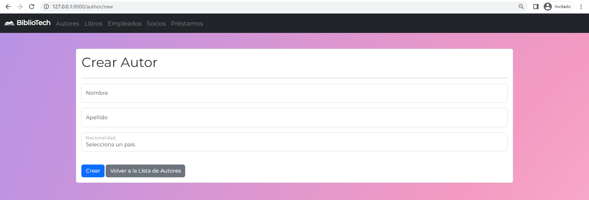

### Actualización de autores <a name = "author-update"></a>

La actualización de autores se realiza a través de un formulario que cuenta con los siguientes campos:

- Nombre
- Apellido
- Nacionalidad

Imagen del formulario de actualización de autores:

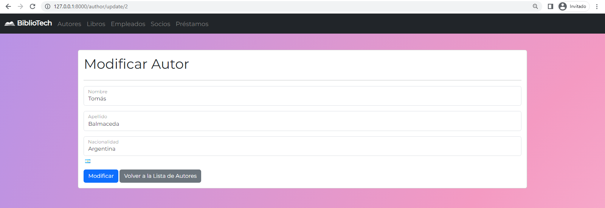

### Listado de autores  <a name = "author-list"></a>

El listado de autores se realiza a través de una tabla que se ve a continuación:

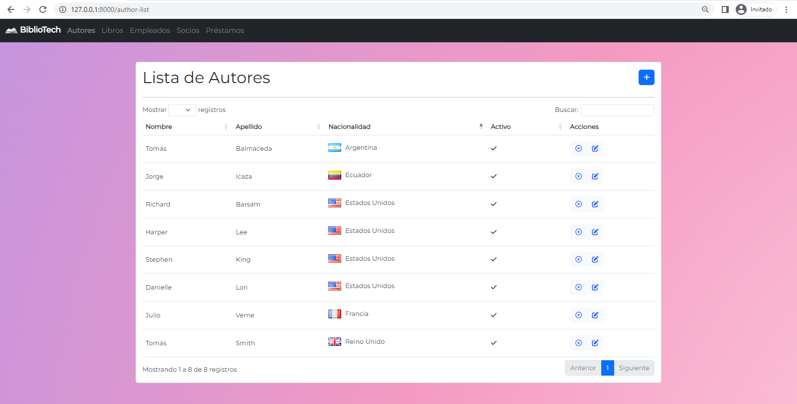

> ### **Módulo Libro:** <a name = "book"></a>

### Creación de libros <a name = "book-create"></a>

La creación de libros se realiza a través de un formulario que cuenta con los siguientes campos:

- Título
- Descripción
- ISBN
- Autor

Imagen del formulario de creación de libros:


### Actualización de libros <a name = "book-update"></a>

La actualización de libros se realiza a través de un formulario que cuenta con los siguientes campos:

- Título
- Descripción
- ISBN
- Autor

Imagen del formulario de actualización de libros:

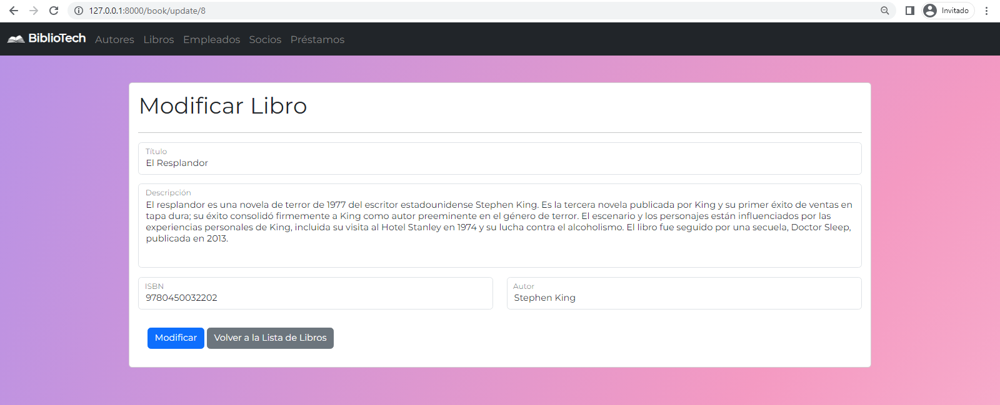

### Listado de libros <a name = "book-list"></a>

El listado de libros se realiza a través de una tabla que se ve a continuación:

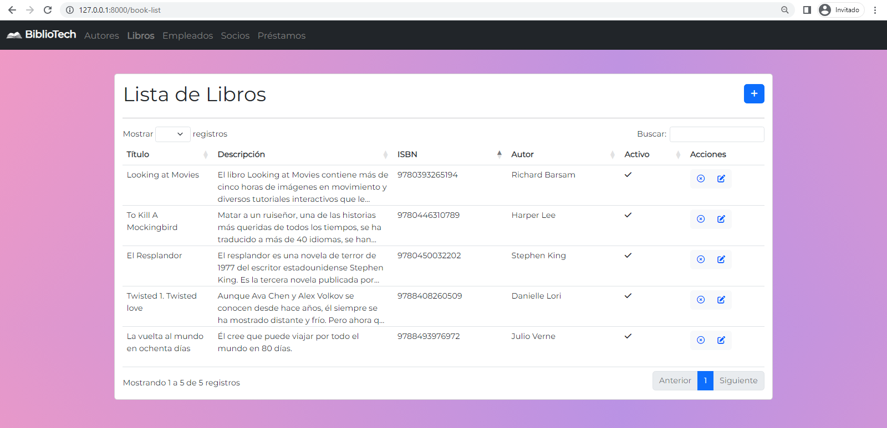

> ### **Módulo Empleado:** <a name = "employee"></a>

### Creación de empleados <a name = "employee-create"></a>

La creación de libros se realiza a través de un formulario que cuenta con los siguientes campos:

- Nombre
- Apellido
- Número de legajo

Imagen del formulario de creación de empleados:

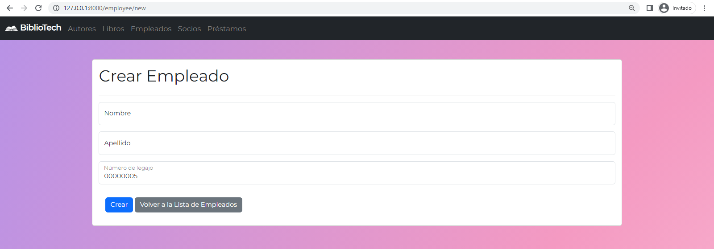

### Actualización de empleados <a name = "employee-update"></a>

La actualización de libros se realiza a través de un formulario que cuenta con los siguientes campos:

- Nombre
- Apellido
- Número de legajo

Imagen del formulario de actualización de empleados:

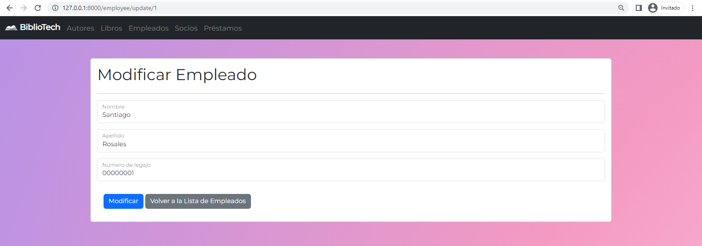

### Listado de empleados <a name = "employee-list"></a>

El listado de empleados se realiza a través de una tabla que se ve a continuación:

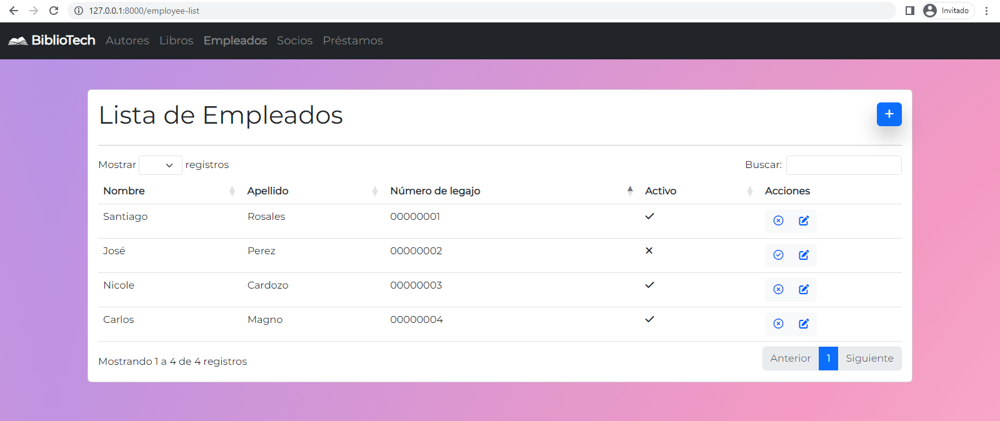

> ### **Módulo Socio:** <a name = "member"></a>

### Creación de socios <a name = "member-create"></a>

La creación de libros se realiza a través de un formulario que cuenta con los siguientes campos:

- Nombre
- Apellido
- Fecha de nacimiento

Imagen del formulario de creación de socios:

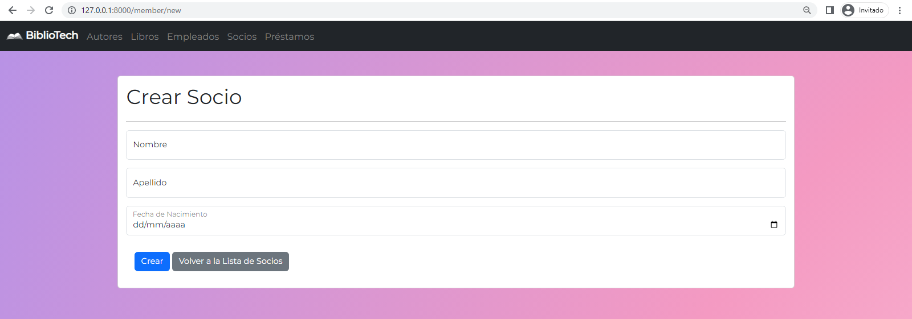

### Actualización de socios <a name = "member-update"></a>

La actualización de libros se realiza a través de un formulario que cuenta con los siguientes campos:

- Nombre
- Apellido
- Fecha de nacimiento

Imagen del formulario de actualización de socios:

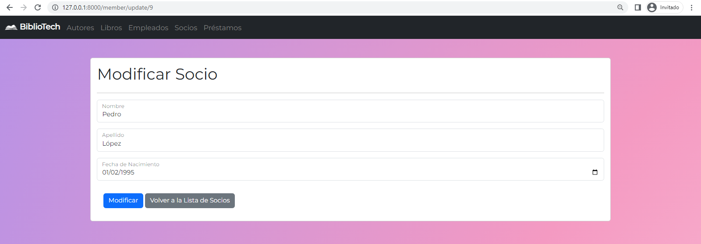

### Listado de socios <a name = "member-list"></a>

El listado de socios se realiza a través de una tabla que se ve a continuación:

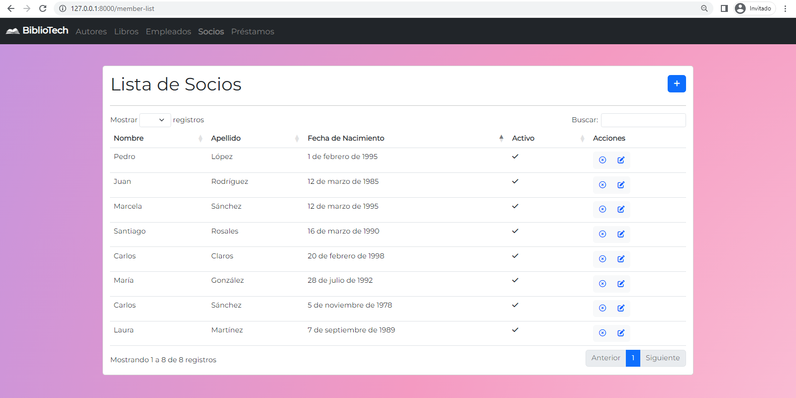

> ### **Módulo Préstamo:** <a name = "lendbook"></a>

### Creación de préstamos <a name = "lendbook-create"></a>

La creación de préstamos se realiza a través de un formulario que cuenta con los siguientes campos:

- Socio
- Libro
- Empleado
- Fecha de préstamo
- Fecha de devolución

Imagen del formulario de creación de préstamos:

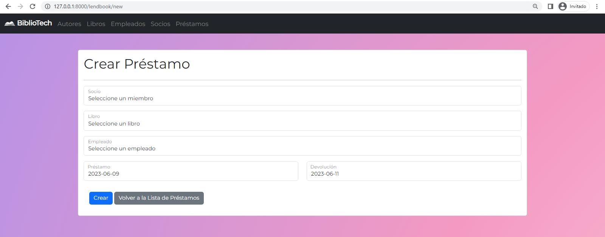

### Actualización de préstamos <a name = "lendbook-update"></a>

La actualización de préstamos se realiza a través de un formulario que cuenta con los siguientes campos:

- Socio
- Libro
- Empleado
- Fecha de préstamo
- Fecha de devolución

Imagen del formulario de actualización de préstamos:

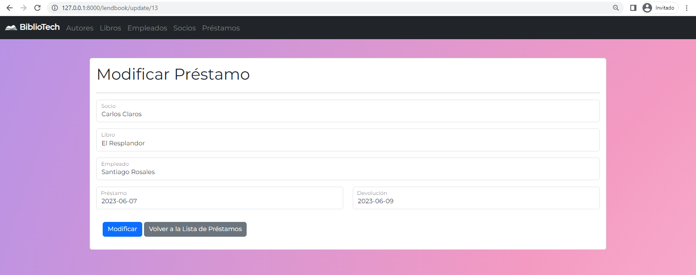

### Eliminación de préstamos <a name = "lendbook-delete"></a>

La eliminación de préstamos se realiza a través de un botón que se encuentra en la tabla de préstamos.

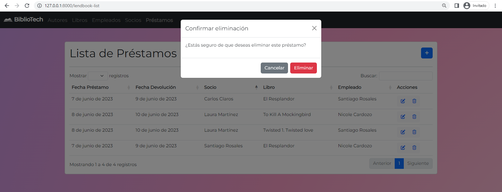

### Listado de préstamos <a name = "lendbook-list"></a>

El listado de préstamos se realiza a través de una tabla que se ve a continuación:

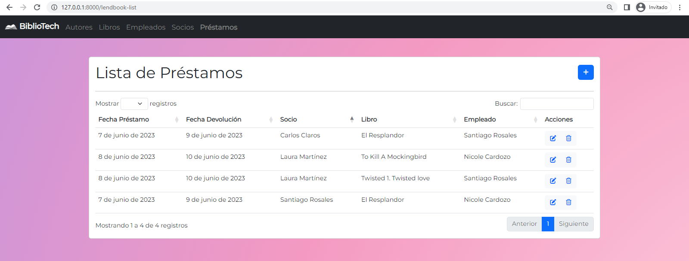

> ### Búsqueda <a name = "search"></a>

La búsqueda se realiza a través de un campo de texto que se encuentra en la parte superior de la tabla de autores, libros, empleados, socios y de préstamos.
 
> ### Paginación <a name = "pagination"></a>

La paginación se realiza a través de un paginador que se encuentra en la parte inferior de la tabla de autores, libros, empleados, socios y de préstamos.

> ### API <a name = "api-functionalities"></a>

### Listado de autores <a name = "api-authors"></a>

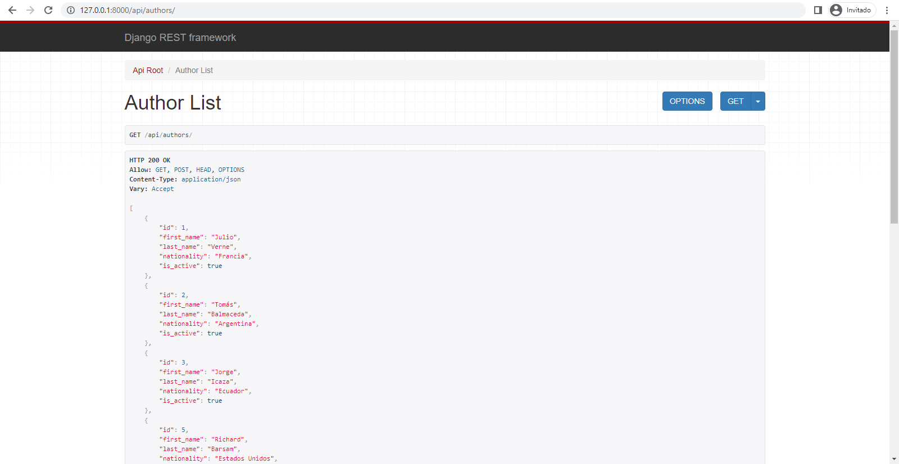

### Obtener un autor <a name = "api-authors-id"></a>

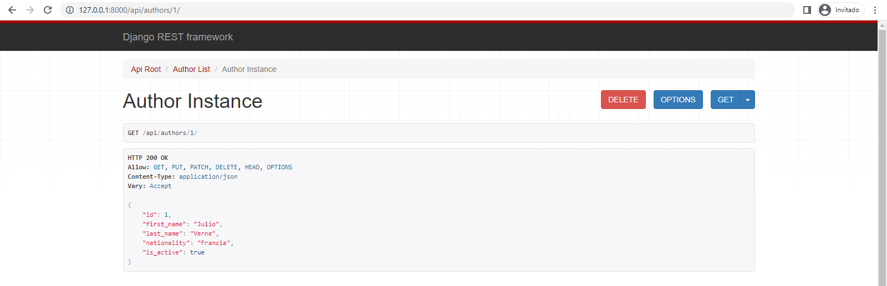

### Listado de libros <a name = "api-books"></a>

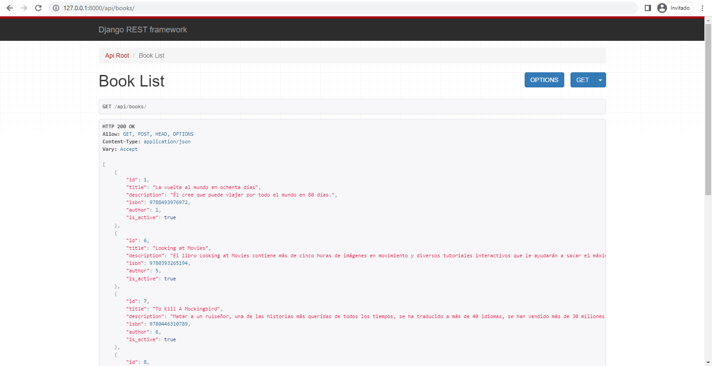

### Obtener un libro <a name = "api-books-id"></a>

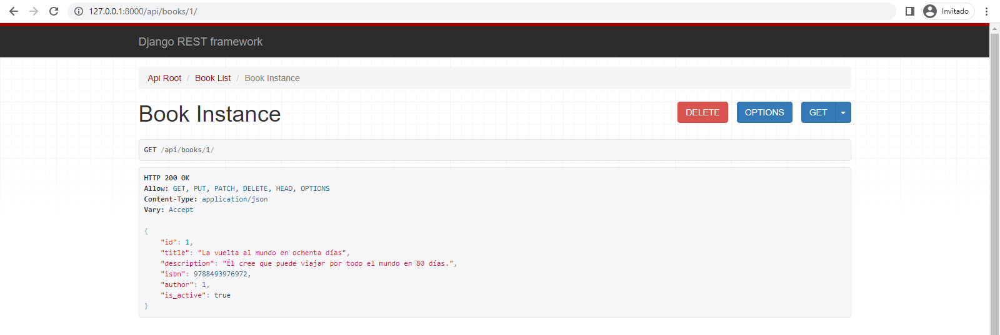

### Listado de empleados <a name = "api-employees"></a>

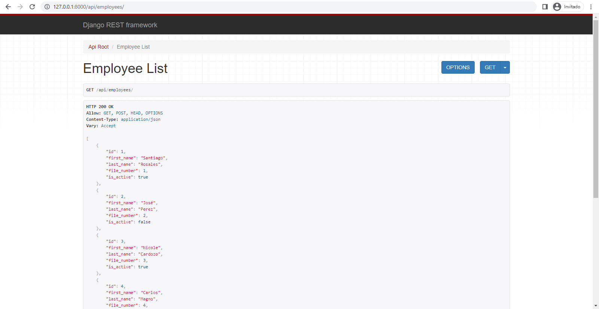

### Obtener un empleado <a name = "api-employees-id"></a>

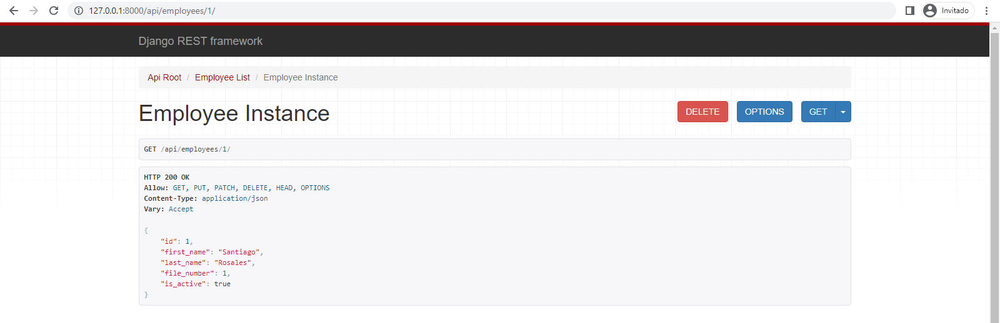

### Listado de socios <a name = "api-members"></a>


### Obtener un socio <a name = "api-members-id"></a>

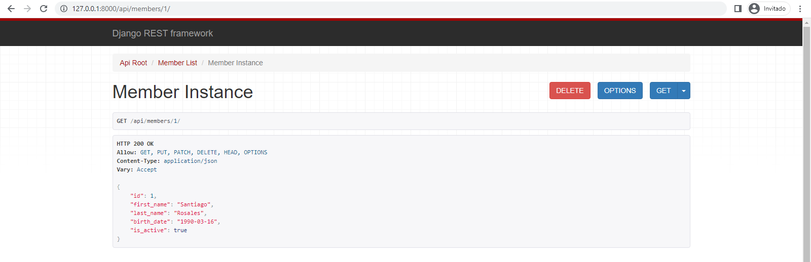

## ⛏️ Tecnologías utilizadas <a name = "technologies"></a>

- Python 3.14.0
- Django 4.2.1
- Bootstrap 5.3.0
- Requests 2.31.0
- Django Rest Framework 3.14.0
- GSAP 3.9.1

## ✒️ Autores <a name = "authors"></a>
- [Santiago Rosales](https://github.com/santiemanuel)
- [José Perez](https://github.com/JosePerezjlp)
- [Nicole Cardozo Gómez](https://github.com/paunicole)